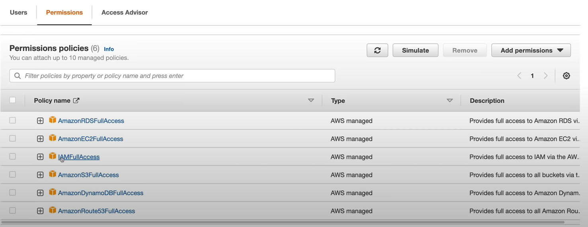

# Get Started with Terraform (Personal get started and notes)

In this project I keep my personal notes for my terraform journey

The main tf set up is a little tricky - have a look <a href="./terraformBaseArchitecture/setup.md">here</a>

## Terraform variables

Three different variable types are supported: locals, Input, Output variables

- locals: variables that are only used in the terraform file
- Input: variables that are used in the terraform file and can be set by the user (e.g. command line arguments)
- Output: variables that are used in the terraform file and are set by the terraform execution (e.g. the return value of a instance, like ip address or hostname)

To set up an input variable you can choose from following options:

- manual entry during plan and apply
- default value in main.tf
- env variables are available in main.tf if they are prefixed with `TF_VAR_*`
- `terraform.tfvars` file
- `*.auto.tfvars` file
- command line -var or var-file

Where to store the sensitive env variables?

- variables can be set to sensitive in the terraform file by adding the `sensitive` attribute to the variable.
- Pass from .env file to terraform
- use AWS secrets manager - an reference it within the terraform file

## System Requirements

- python
- aws cli
- terraform

## Commands

To configure aws cli:

```bash
aws configure
```

Terraform will scan the main.tf file and see what modules are required and download all of them to the local directory.

```bash
terraform init
```

Terraform will check the difference between the current running state and the locally defined state. It will show us what it would do to bring the current state up to date with the desired state.

```bash
terraform plan
```

The apply command is there to apply the planed changes after they have been reviewed.

```bash
terraform apply
```

The destroy command is there to destroy the current state.

```bash
terraform destroy
```

## AWS configurations

The terraform user needs basic access below are the required permissions



- RDS Access (for creating and deleting databases)
- EC2 Access (Manage VMs)
- IAM Access (Manage users)
- S3 Access (Manage S3 buckets)
- DynamoDB Access (Manage DynamoDB tables) (Required to store the terraform configuration)
- Route53 Access (Manage Route53 records)

## Sources

<a _blank href="https://www.youtube.com/watch?v=7xngnjfIlK4&t">Complete Terraform Course - From BEGINNER to PRO! (Learn Infrastructure as Code) from DevOps Directive<a>
